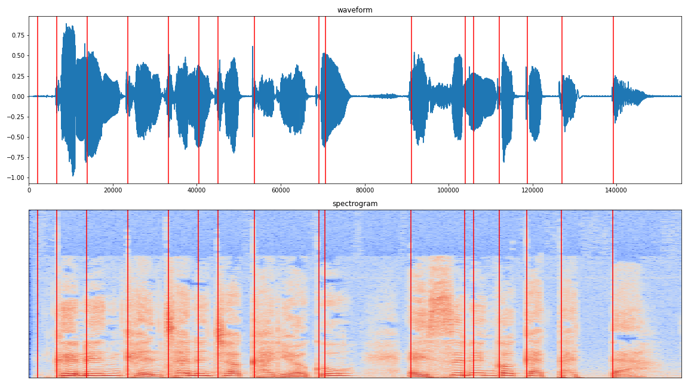

# Voice Converter
> Module for freely modifying or controlling voice  
> [한국어/Korean](./README_KR.md)


## Introduction

> The source of this repository is [Contents](https://futureskill.io/content/aae67c6d-236e-4667-8b5e-e59668f0b562) in [FutureSkill](https://futureskill.io/).

Transforming/controlling voice freely through **Voice-Transforming-Module**. This file can be viewed as a review note that carefully summarizes the content, process and study results.


#### Goals

- <u>[Final] Creating a module that produces a voice with the desired variation on the input voice</u>
- (Goal 1) Understanding and extracting elements of speech (size, speed)
- (Goal 2) **Tone conversion** using *pyworld vocoder*
- (Goal 3) **Speed(tempo), emotional conversion** with *pysox module*
- (Goal 4) Applying **noise**, **reverb**

By understanding various characteristic features of the voice and how to control them, it is a step that makes the process of preprocessing and augmentation easier in the future. The overall development was carried out at *Google Colab.*


## Contents

1. [Examining Voice Data](#1-examining-voice-data)
2. [Analyzing Voice Data (rms, pitch)](#2-analyzing-voice-data-rms-pitch)
3. [Analyzing Voice Data (timing)]( #3-analyzing-voice-data-timing)
4. [Reconstruction 1](#4-reconstruction1)
5. [Reconstruction 2](#5-reconstruction2)
6. [Pitch Control (key change)](#6-pitch-control-key-change)
7. [Pitch Control (emotional)](#7-pitch-control-emotional)
8. [Speed Control](#8-speed-control)
9. [Noise Control](#9-noise-control)
10. [Reverb Control](#10-reverb-control)
11. [Voice Converter](#11-voice-converter)


> Last Update: 2021.08.12.

### 1. Examining Voice Data

> *"그는 괜찮은 척 하려고 애쓰는 것 같았다."*  It's a Korean sentence which is in [speech.wav](./speech.wav) file.

**Voice** means the sound a person makes through the vocal organs. Voices include *verbal voices* such as speech and singing, as well as *nonverbal voices* such as laughter and coughing. Let's focus on verbal speech, especially the voice used in general conversations. The libraries that will be used continuously in this content are as follows.

~~~python
import numpy as np  
import librosa
import matplotlib 
matplotlib.use("Agg")
import matplotlib.pyplot as plt 
import librosa.display
~~~

And In my case, I use the following method to listen to audio in Colab. There will be many situations where it will be used conveniently afterwards.

~~~python
import IPython.display as ipd
ipd.Audio('speech.wav')
~~~

If you enter the sound path you want to hear in the bracket, player will be output beautifully.


First, define the Spectrogram() function.

~~~python
def Spectrogram(wav):
		stft = librosa.stft(wav)
		stft = np.abs(stft)
		return stft
~~~


Then load the file [`speech.wav`](./speech.wav) using the [**librosa**](https://librosa.org/doc/latest/index.html) library  
and draw the waveform, spectrogram of it using the [**matplotlib**](https://matplotlib.org/) library

~~~python
audio, sr = librosa.load('speech.wav', sr=None)
spectrogram = np.log(Spectrogram(audio)+1e-5)

plt.figure(figsize=(16,9))
plt.subplot(2,1,1)
plt.plot(audio)
plt.xlim([0,len(audio)])
plt.title('waveform')
plt.subplot(2,1,2)
librosa.display.specshow(spectrogram)
plt.title('spectrogram')
plt.tight_layout()
plt.savefig('example1_output.png')
# plt.close()
~~~


### 2. Analyzing Voice Data (rms, pitch)

**Waveform** is a graph of pressure information over time, indicating how much pressure was applied to the microphone at some point.

As a result of the Short-Time Fourier Transform (STFT) application to these waveforms, it is possible to visualize how strong each frequency component is represented at that moment, depending on the time limit of the small window. Both information contains very detailed information, but we sometimes need more intuitive information.


This time, we will proceed with the process of outputting **rms** and **pitch** information, which are more familiar concepts to us.

**RMS (Strength)** is the value taken root from the square mean of all pressure values within a particular window inside the waveform. In general, this value tends to increase if we record a 'big sound', whereas a small sound tends to be small. It can be calculated through the `librosa.feature.rms` function.

**Pitch** means the height of a sound over time that is included in the speech. The higher the pitch, the higher the frequency. Pitch sequence can be printed through the `pyworld` library.


So we need [**pyworld**](https://github.com/JeremyCCHsu/Python-Wrapper-for-World-Vocoder) library.

~~~python
!pip install pyworld
~~~

After installing pyworld, code is as follows.

 ~~~python
 import pyworld as pw 
 
 audio, sr = librosa.load('speech.wav', sr=None)
 spectrogram = np.log(np.abs(librosa.core.stft(audio))+1e-5)
 
 audio = np.asarray(audio, dtype='float64')
 
 _f0, t = pw.dio(audio, sr) # raw pitch extractor
 f0 = pw.stonemask(audio, _f0, t, sr) # pitch refinement
 rms = librosa.feature.rms(audio) 
 plt.figure(figsize=(16,9))
 
 plt.subplot(4,1,1)
 plt.plot(audio)
 plt.xlim([0,len(audio)])
 plt.title('waveform')
 
 plt.subplot(4,1,2)
 librosa.display.specshow(spectrogram)
 plt.title('spectrogram')
 
 plt.subplot(4,1,3)
 plt.plot(rms[0])
 plt.xlim([0,len(rms[0])])
 plt.title('rms')
 
 plt.subplot(4,1,4)
 plt.plot(f0)
 plt.xlim([0,len(f0)])
 plt.title('pitch')
 
 plt.tight_layout()
 plt.savefig('example2_output.png')
 plt.close()
 ~~~


### 3. Analyzing Voice Data (timing)

Previously we learned how to output waveform, spectrum, rms, and pitch information over each time period from a given voice. Thus, given the sound source and specific time points, various information can be identified at that time.

So how do we get the information about the **timing**? For example, the given sound source emits a string in Korean that says, **"그는 괜찮은척 하려고 애쓰는것 같았다."**, which is translated into English as **"He seemed to be trying to pretend to be okay."** How do we figure out when the syllables such as `He` or `seemed`  begin?

In fact, it is not easy to guess the information about the linguistic expression from speech, which is studied by various names and fields such as `Speech-to-text`, `Automatic Speech Recognition`, and `Speech-Text Alignment`. However, as one of the simplest approaches, we can experiment with determining when a new event appears in a given sequence.

`onset` can be defined as '**the begining of a musical note or other sound**', and the librosa library provides an [`onset_detect`](https://librosa.org/doc/main/generated/librosa.onset.onset_detect.html#librosa.onset.onset_detect) function that calculates when an onset might have appeared from the waveform.

Once find the onset, we can use the matplotlib to draw lines on the plot.

~~~python
import soundfile as sf # Library for creating audio files

audio, sr = librosa.load('speech.wav', sr=None)
onsets = librosa.onset.onset_detect(audio, sr=44100, hop_length=512)
onsets = librosa.frames_to_time(onsets, sr=44100, hop_length=512)
# print(onset_times) # check

plt.figure(figsize=(16,9))
plt.subplot(2,1,1)
plt.plot(audio)
plt.xlim([0,len(audio)])

for item in onsets:
    plt.axvline(x=(int)(item*sr), c='r')
    # print(item) # check
    # A function that draws a vertical line in the x-position
plt.title('waveform')

plt.subplot(2,1,2)
librosa.display.specshow(spectrogram)
for item in onsets:
    plt.axvline(x=(int)(item*sr)/512, c='r')
plt.title('spectrogram')

plt.tight_layout()
plt.savefig('example3_output.png')
plt.close()

for i in range(len(onsets[:-1])):
    sf.write('example3_output_'+str(i).zfill(2)+'.wav', audio[(int)(onsets[i]*sr):(int)(onsets[i+1]*sr)], sr)
~~~



By listening to the 16 sound sources generated by the above code, you can see that they are stored, although not very accurate, but broken every syllable.


### 4. Reconstruction1

Through a series of previous examples, we learned how to 'extract' multiple features from a given voice. However, our final goal is to design a module that 'creates' a modified voice.

In general, the process of converting the voice can be considered as follows.

`voice` → `(1)feature extract` → `(2)feature convert` → `(3)feature reconstruct` → `converted voice`

We have conducted a process corresponding to (1) and need to understand (2) and (3) for successful module design.

For `(1)feature extract ` and  `(3)feature reconstruct` to be possible, the inverse process of the extraction operation must be defined. Typically Short Time Fourier Transform(STFT) is a variant that can define Inverse Short Time Fourier Transform(ISTFT), so reconstruction is possible.

~~~python
audio, sr = librosa.load('speech.wav', sr=None)
spectrogram = librosa.core.stft(audio)
 
audio_recon = librosa.istft(spectrogram, hop_length=512)

sf.write('speech_recon.wav', audio_recon, sr)
~~~

As shown above, a Spectrogram can be extracted from a given sound source, and a restored wave can be created and stored again through the Spectrogram.


### 5. Reconstruction2

Short time fourier transform으로 변형된 feature에는 우리가 원하는 feature 변형의 과정을 진행하기가 쉽지 않다. 예컨데 음정을 올리고 싶은 경우, 우리는 STFT feature에 어떠한 변환과정을 진행해야 하는지 판단하기 어렵다. 이런 한계점을 극복하기 위해서 우리는 pyworld vocoder를 활용할 수 있다.

pyworld vocoder는 [world vocoder](https://pdfs.semanticscholar.org/560a/be3b4482335a93df309cb6a0185ccc3ebd8e.pdf?_ga=2.93225115.742467816.1601196298-72658375.1564975111)의 python 버전 구현체이며, 논문에 따르면 주어진 waveform을 세개의 feature (`Fundamental frequency`, `Spectral Envelope`, `Aperiodic parameter`)로 분리하는 세개의 알고리즘과, 이 세개의 feature를 다시 waveform으로 합성하는 synthesis 알고리즘으로 구성되어있다.

따라서 우리는 이 **추출-재합성 알고리즘**을 사용하면, pitch 정보를 원하는대로 변형한 재합성이 가능하다.

pyworld 라이브러리를 활용하여 주어진 음원에서 `f0`, `spectral envelope`, `aperiodic parameter`를 추출하여 그림을 그리고, 이를 재합성해서 reconstructed wave를 생성해보자.

~~~python
import pyworld as pw

audio, sr = librosa.load('speech.wav', sr=None, dtype='float64')

# raw pitch extractor
_f0, t = pw.dio(audio, sr)
# pitch refinement
f0 = pw.stonemask(audio, _f0, t, sr)
# extract smoothed spectrogram
sp = pw.cheaptrick(audio, _f0, t, sr)
# extract aperiodicity
ap = pw.d4c(audio, f0, t, sr)

y = pw.synthesize(f0, sp, ap, sr)
sf.write('speech_recon_pyworld.wav', y, sr)

plt.figure(figsize=(16,9))
plt.subplot(4,1,1)
plt.plot(audio)
plt.xlim([0,len(audio)])
plt.title('waveform')
plt.subplot(4,1,2)
librosa.display.specshow(np.log(sp.T+1e-5))
plt.title('sp')
plt.subplot(4,1,3)
librosa.display.specshow(np.log(ap.T+1e-5))
plt.title('ap')
plt.subplot(4,1,4)
plt.plot(f0)
plt.xlim([0,len(f0)])
plt.title('pitch')

plt.tight_layout()
plt.savefig('example4_output.png')
plt.close()
~~~


추출-재합성 과정에서 힘든 부분이 있을 경우 [pyworld document](https://github.com/JeremyCCHsu/Python-Wrapper-for-World-Vocoder)를 참고하면 큰 도움이 된다.


### 6. Pitch Control (key change)

**Pitch**는 1초에 몇 번 진동하는지에 대한 Hz 단위로 표시가 가능하고, 우리가 음악에서 말하는 한 키, 한 옥타브 등의 단위로도 표현이 가능하다. 1 옥타브 높은 음은 원래 주파수의 2배의 주파수 값을 가지며, 한 옥타브는 12개의 음계로 이루어져 있다. 이를 활용하면 다음과 같은 코드를 작성할 수 있다.

~~~python
def key_change(audio, key):
    _f0, t = pw.dio(audio, sr)   
    f0 = pw.stonemask(audio, _f0, t, sr) 
 
    f0 = f0 + (f0 * key / 12)
    # 한 옥타브 차이는 주파수 두 배 차이이며, 옥타브는 12개의 음계로 이루어져있다.
    # 따라서 기존 주파수 f0에, f0을 열두개로 나눈 음계를 'key'만큼 더해주면 된다.
 
    sp = pw.cheaptrick(audio, f0, t, sr) 
    ap = pw.d4c(audio, f0, t, sr)        
    y = pw.synthesize(f0, sp, ap, sr)
    return y

sf.write('speech_up1.wav', key_change(audio, 1), sr)
sf.write('speech_up2.wav', key_change(audio, 2), sr)
sf.write('speech_up3.wav', key_change(audio, 3), sr)
 
sf.write('speech_down1.wav', key_change(audio, -1), sr)
sf.write('speech_down2.wav', key_change(audio, -2), sr)
sf.write('speech_down3.wav', key_change(audio, -3), sr)
~~~

생성된 파일을 들어보면 음성이 마치 노래방에서 키를 올리고 내린 것처럼 조절된 것을 확인할 수 있다.

이와 같이 우리는 pyworld vocoder를 통해 주어진 음원으로부터 pitch 정보를 제어할 수 있다. 즉 음원 `y`에서 `f0` 를 추출하고, 이를 원하는 대로 변형한 `f0'` 을 생성한 후, `f0'`, `sp`, `ap` 를 통해 `y'` 을 재합성해내는 과정을 진행할 수 있다.


### 7. Pitch Control (emotional)

우리는 주어진 음원에서 전체적으로 음고를 높이거나 낮추는 방법에 대해 알아보았다. 더 나아가서 이를 활용하면 특정 영역에서만 높이고 낮추는 것도 가능할 것이다. 이러한 확장을 넘어서, 이번에는 pitch 전체의 분포를 변형시켜 보는 과정을 진행하고자 한다. 우리가 pyworld를 통해서 얻어낸 pitch들은 시간에 따라 값이 변화하는 sequential 한 데이터이며, 여러개의 데이터의 집합으로 이루어져 있다.

그렇다면 이 데이터에는 평균적인 pitch가 존재할 것이고, 이 평균으로부터 전체 데이터가 얼마나 멀리 떨어져있는지에 대한 분산 또한 존재할 것이다. 앞선 문제에서는 분산은 고정시킨 채, 평균 값을 변화시킴으로서 목소리의 높낮이를 조정했던 것이라고 이해할 수 있다. 그렇다면, 분산을 변화시켰을 때는 어떤 변화가 일어날까?

~~~python
def std_change(audio, alpha):
    _f0, t = pw.dio(audio, sr)
    f0 = pw.stonemask(audio, _f0, t, sr)
    mean = np.mean(f0[np.nonzero(f0)])
    std = np.std(f0[np.nonzero(f0)])
    f0[np.nonzero(f0)] -= mean

    f0[np.nonzero(f0)] /= 1
    f0[np.nonzero(f0)] *= alpha

    f0[np.nonzero(f0)] += mean
    sp = pw.cheaptrick(audio, f0, t, sr)
    ap = pw.d4c(audio, f0, t, sr)
    y = pw.synthesize(f0, sp, ap, sr)
    return y

sf.write('speech_up_std.wav', std_change(audio, 2.0), sr)
sf.write('speech_down_std.wav', std_change(audio, 0.5), sr)
~~~

간단하게 생각해본다면, 분산이 더 커지는 경우 데이터 간 변화가 더욱 커지게 되므로 조금 더 활기찬, 혹은 흥분된 목소리로, 분산이 더 작아질 경우에는 밋밋하고 변화가 없는 단조로운 목소리로 만들 수 있을 것이다.


### 8. Speed Control

앞선 예제들을 통해서 주어진 오디오로부터 추출된 음고 정보를 변형한 새로운 목소리를 생성하는 것에 대해 알아보았다. 이번엔 새로운 library인 `sox`를 활용하여 음고 뿐만 아니라 빠르기, 세기 등 다양한 변환을 sequential 하게 처리하는 모듈을 디자인해보고자 한다.

옛날에 카세트 테이프를 '빨리 감기' 해서 들어본 적이 있을 것이다. 일반적으로 동영상을 배속 재생해도 그렇다. 남자 목소리가 빨라진 속도만큼 얇아져서 마치 여자 목소리처럼 들리는 경우가 있다. 이는 속도가 변하면서 음정이 함께 변한 것이다.  ~~이승철 노래를 0.8배속 정도로 들으면 박명수 목소리가 나더라~~

주어진 음원의 속도를 변화시키는 방법은 크게 두 가지로 나눌 수 있다. 하나는 음정을 고정한 채 빠르기만 변화시키고, 다른 하나는 음정과 빠르기가 함께 변화하는 것이다.

pysox module의 [transformer documentation](https://pysox.readthedocs.io/en/latest/api.html) 을 참고하여 함수를 만들어 보자. 먼저 sox를 설치해준다.

~~~python
! apt-get install libsox-fmt-all
! apt-get install sox
! pip install sox
~~~

이후 두 가지 변환에 대한 함수를 각각 만들어준다. 중간에 주석으로 둔 부분(out을 정의하고 반환하는 부분)은 나중에 전체 목소리 변환기를 만들 때 다시 주석 해제해주면 된다.

~~~python
import sox
def speed_sox(audio, rate):
  tfm = sox.Transformer() # 변환 모듈 선언
  tfm.speed(rate)
  # out = tfm.build_array(input_array=audio, sample_rate_in=sr)
  # return out
  tfm.build_file(output_filepath= 'speech_speed_' + (str)(rate) + '.wav', input_array=audio, sample_rate_in=sr)

def tempo_sox(audio, rate):
  tfm = sox.Transformer()
  tfm.tempo(rate)
  # out = tfm.build_array(input_array=audio, sample_rate_in=sr)
  # return out
  tfm.build_file(output_filepath= 'speech_tempo_' + (str)(rate) + '.wav', input_array=audio, sample_rate_in=sr)

speed_sox(audio, 0.8)
speed_sox(audio, 1.2)

tempo_sox(audio, 0.8)
tempo_sox(audio, 1.2)
~~~

위와 같이 주어진 음원의 속도를 변화시키는 두개의 변환을 찾아 각각을 적용하는 함수를 작성할 수 있다.


### 9. Noise Control

지금까지 우리는 주어진 음원의 음정, 빠르기를 변환하는 방법을 알아보았다. 이번에는 신호 자체를 넘어서 신호에 gaussian 노이즈를 더해보고자 한다. 이는 향후 응용하고자 하는 task별로 상이할 수 있지만, 모델을 보다 강인하게 만드는 augmentation 방법으로도 활용할 수 있다. noise는 np.random.normal을 활용하여 생성한다.

~~~python
def add_noise(audio, rate):
    noise = np.random.normal(0, 1, 155520) # size를 기존 음원과 동일하게 줘야함
    return audio + rate*noise

sf.write('speech_noise_0.01.wav', add_noise(audio, 0.01), sr)
sf.write('speech_noise_0.1.wav', add_noise(audio, 0.1), sr)
~~~

noise의 `mean` 과 `std`는 각각 0, 1로 설정하고, 정도를 조절할 수 있는 파라미터를 함께 입력받도록 하여 다양한 수준의 SNR 레벨을 가진 음원을 생성해볼 수 있다.


### 10. Reverb Control

8번까지 우리는 신호 자체를 변환하는 방법을 알아보았다. 9번에서는 신호에 노이즈를 더해주었다. 노이즈를 더해주었던 것과 유사하게, impulse reponse 를 적용해서 리버브를 걸어보는 연습을 해보고자 한다. 또한, reverb 도 augmentation 방법으로 활용할 수 있다.

자연에서 reverb가 생기는 과정은 원본 신호 이외에 공간 등에 반사된 신호가 시간차를 두고 마이크로 수음되어 더해지는 과정이라고 생각하면 된다. 그리고 이를 실험적으로 모델링하기 위해서는, 특정 공간에 대한 impulse response를 생성(혹은 취득)한 뒤, 해당 response를 원본 신호에 convolve 하는 방법을 사용할 수 있다. 이 때 impulse response는 해당 공간에서 impulse 를 발생시켰을 때 마이크로 수음되는 소리를 의미한다.

주어진 impulse는 [reverb.wav](./reverb.wav)를 사용한다.

~~~python
import scipy

audio, sr = librosa.load('/content/speech.wav')
reverb, sr = librosa.load('/content/reverb.wav')
def apply_reverb(audio, reverb):
    out = scipy.signal.convolve(audio, reverb)
    return out

sf.write('speech_reverb.wav', apply_reverb(audio, reverb), sr)
~~~

핵심은 speech 신호에 **convolution** 연산을 적용하는 것이다. [scipy.signal.convolve](https://docs.scipy.org/doc/scipy/reference/generated/scipy.signal.convolve.html)를 참고해 보자. output을 들어보면 확실히 소리에 reverb가 반영된 것을 알 수 있다.


### 11. Voice Converter

지금까지 배웠던 내용을 하나의 함수로 작성해보는 과정이다. 입력 조건을 정리하면 다음과 같다.

- `pitch` : pitch를 몇 키 높일지/낮출지 결정하는 입력
- `pitch_var` : pitch variance를 몇배로 늘릴지/줄일지 결정하는 입력
- `tempo` : 몇배 빠르게/느리게 재생할지 결정하는 입력
- `change` : 목소리를 변화시킬지 아닐지 결정하는 입력
- `noise` : noise 를 얼마나 더할지 결정하는 입력
- `reverb` : reverb 를 걸지 말지 결정하는 입력

~~~python
def voice_changer(audio_path, pitch, pitch_var, tempo, change, noise, reverb):
    audio, sr = librosa.load(audio_path, sr=22050, dtype='float64')
    ir, sr = librosa.load('/content/00x00y.wav', sr = sr)
    audio = std_change(audio, pitch_var) # 분산 조절
    audio = key_change(audio, pitch) # 높낮이 조절
    if change :
        audio = speed_sox(audio, tempo) # 빠르기(pitch 포함) 조절
    else : 
        audio = tempo_sox(audio, tempo) # 빠르기(pitch 제외) 조절
    audio = add_noise(audio, noise) # noise 조절
    if reverb:
        audio = apply_reverb(audio, ir) # reverb 조절
    return audio

out = voice_changer('/content/speech.wav', 1.2, 0.5, 0.7, False, 0.01, False)
sf.write('output.wav', out, sr)
~~~

기본 sample rate를 44100으로 두고 했더니 변형이 제대로 되지 않아서 22050으로 바꾸었더니 동일한 사운드를 확인할 수 있었다. (but why?)

그리고 `speed_sox`와 `tempo_sox` 같은 경우 기존에 만들었던 함수는 파일을 생성하기만 하기 때문에 조금 수정하여 아래와 같이 return 값을 만들어주었다. 앞서 말했듯 out에 대한 주석만 해제하면 된다.

```python
import sox

def speed_sox(audio, rate):
  tfm = sox.Transformer()
  tfm.speed(rate)
  out = tfm.build_array(input_array=audio, sample_rate_in=sr) # build_file 대신 build_array를 사용하여 반환값 생성
  return out
  # tfm.build_file(output_filepath= 'speech_speed_' + (str)(rate) + '.wav', input_array=audio, sample_rate_in=sr)


def tempo_sox(audio, rate):
  tfm = sox.Transformer()
  tfm.tempo(rate)
  out = tfm.build_array(input_array=audio, sample_rate_in=sr)
  return out
  # tfm.build_file(output_filepath= 'speech_tempo_' + (str)(rate) + '.wav', input_array=audio, sample_rate_in=sr)
```

마지막으로 음원에 효과를 더할 때마다 음원 자체의 size가 달라져서 noise 연산이 막히는 문제를 확인했다. 따라서 `np.random.normal` 내부 size 변수를 유동적으로 바꾸어 주었다.

```python
def add_noise(audio, rate):
    noise = np.random.normal(0,1, np.size(audio)) 
    return audio + rate*noise

sf.write('speech_noise_0.01.wav', add_noise(audio, 0.01), sr)
sf.write('speech_noise_0.1.wav', add_noise(audio, 0.1), sr)
```


주어진 음원을 이루고 있는 다양한 인지적인 요소들에 대해 파악하고, 그것들 중 제어할 수 있는것에 대해 변형을 수행하는 모듈을 만들어보았다. 학습 과정에서 다룬 요소들을 제외하고도 언어적 특징, 음색, 더욱 복합적인 감정 및 비언어적 표현 등을 구현하는 다양한 정보들이 존재하며, 이는 조금 더 복잡하고 정교한 모델링을 통해 이해하고 제어할 수 있다고 한다.

학습을 진행하며 몇몇 문제의 경우 document를 참고하고도 풀리지 않거나, 왜 이렇게 되는 건지 알 수 없어서 한 문제에 며칠씩 매달린 경우도 있었지만, 결국 그렇게 어려운 것이 아니라 한 두 단계의 응용만 거치면 해결할 수 있는 것이었다. 

결국 FutureSkill 플랫폼 사용자 전체 중 본 컨텐츠를 최초로 완주할 수 있었다. 이전부터 오디오 프로세싱에 관심이 많았지만 어떻게 접근해야할지 몰랐는데 문제를 하나씩 풀어가며 다양한 documents를 참고하는 과정에서 많은 것을 배웠다. 정말 좋은 경험이었다. 소중한 컨텐츠 제공해주신 이주헌 크리에이터님께 감사의 말씀 꼭 전해드리고 싶다.


---

#### Reference

- [Future Skill](https://futureskill.io/)

#### Editor

- [**Colab**](https://colab.research.google.com/) / PyCharm
